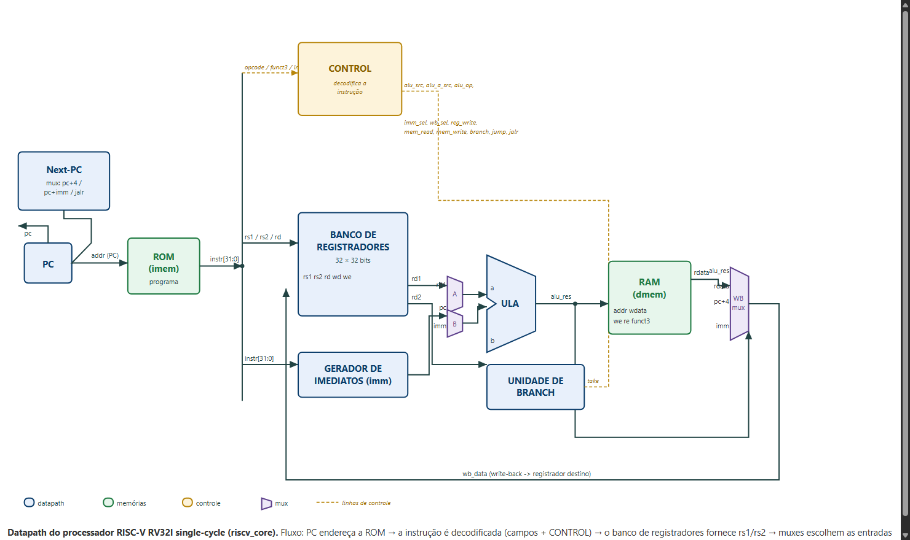
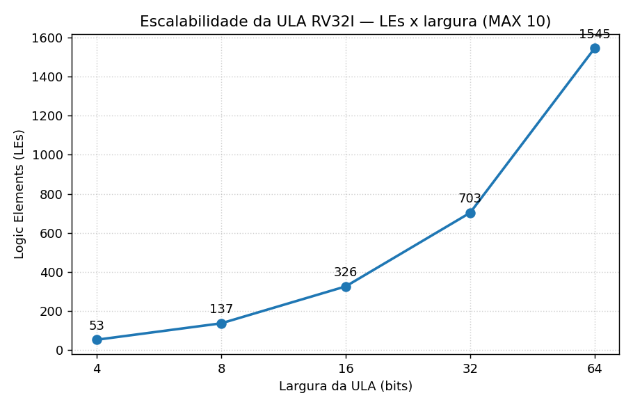
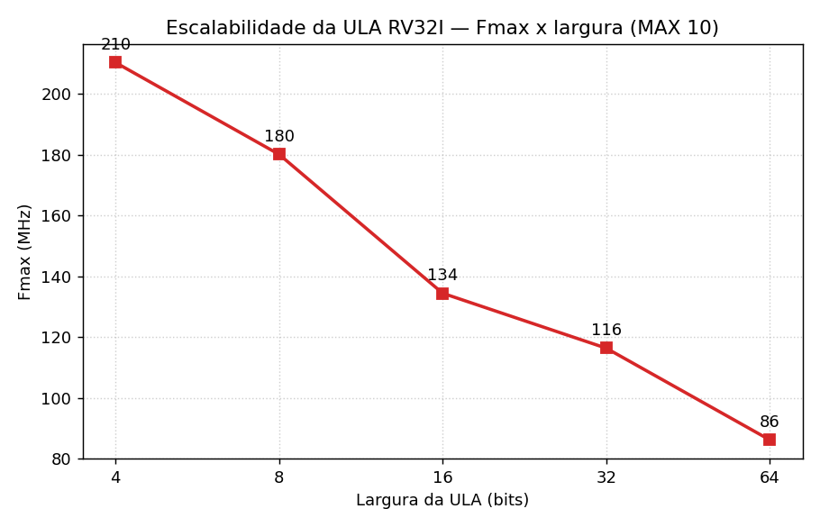

# Processador RISC-V RV32I em FPGA — e por que não no CPLD

Implementação de um **processador RISC-V RV32I single-cycle** em **VHDL-2008**, com uma
**calculadora em assembly** rodando sobre ele. O mesmo sistema foi sintetizado e executado
em **duas placas FPGA diferentes** (DE10-Lite / MAX 10 e DE2 / Cyclone II) e analisado em
uma terceira placa **CPLD** (MAX II / EPM570), onde **não cabe** — com a explicação técnica
do porquê. Inclui ainda um estudo de **escalabilidade da ULA** (área e frequência em função
da largura).

---

## Visão geral

- **Processador:** RISC-V **RV32I** single-cycle (uma instrução por ciclo de clock).
- **Demonstração:** uma **calculadora acumulador** escrita em assembly que roda no próprio
  processador — é a prova de que a CPU funciona de verdade.
- **Portabilidade:** o mesmo código RTL roda em **MAX 10** e **Cyclone II** sem alterar o
  núcleo (apenas um wrapper adapta o clock e os displays).
- **Verificação:** **5/5 testbenches** passam em simulação (GHDL) antes de qualquer gravação.
- **Estudo de escalabilidade:** ULA parametrizada em largura, sintetizada de 4 a 64 bits.

## Características do processador

| Item | Descrição |
|---|---|
| ISA | RISC-V RV32I (inteiro, 32 bits) |
| Microarquitetura | Single-cycle |
| Instruções | Tipo-R, tipo-I, 6 branches (BEQ/BNE/BLT/BGE/BLTU/BGEU), LW/SW, JAL/JALR, LUI/AUIPC |
| Registradores | 32 × 32 bits (x0 fixo em zero) |
| ULA | 10 operações (ADD, SUB, AND, OR, XOR, SLL, SRL, SRA, SLT, SLTU) |
| Memórias | ROM 256×32 (instruções) e RAM 256×32 (dados), endereçadas por byte |
| Entrada/Saída | Mapeada em memória (chaves, botões, LEDs e displays) |
| Display | Decimal com sinal (conversão binário→BCD por *double-dabble*) |
| Linguagem | VHDL-2008 |

## Arquitetura

O caminho de dados (*datapath*) single-cycle: o PC busca a instrução na ROM, o controle a
decodifica, o banco de registradores fornece os operandos, a ULA calcula (e endereça a RAM
em LW/SW) e o resultado retorna pelo *write-back*.



## A calculadora (demonstração)

A calculadora é um programa em assembly (`asm/calc.s`) do tipo **acumulador**: entra-se um
valor, confirma-se, entra-se outro, e o processador guarda o total em um registrador.

| Controle | Função |
|---|---|
| `SW[7:0]` | Valor a aplicar (0–255, em binário) |
| `SW[9:8]` | Operação: `00`=+ · `01`=− · `10`=& · `11`=\| |
| `KEY1` | Enter/= (aplica `acc = acc <op> valor`) |
| `KEY0` | Limpar (zera o acumulador) |
| `HEX0–5` | Resultado em decimal com sinal |
| `LEDR8` / `LEDR9` | Sinal negativo / overflow |

O tratamento do botão usa **debounce por software** (uma pressão = uma operação). Detalhes
de uso em [`docs/calculadora_guia.pdf`](docs/calculadora_guia.pdf) e
[`docs/como_rodar_na_placa.pdf`](docs/como_rodar_na_placa.pdf).

## Resultados — as três placas

O mesmo processador roda nas duas placas FPGA. Na placa CPLD (MAX II) ele **não cabe**.

| | DE10-Lite | DE2 | MAX II |
|---|---|---|---|
| Chip | MAX 10 (10M50DAF484) | Cyclone II (EP2C35F672) | EPM570T144 |
| Tipo | FPGA | FPGA | **CPLD** |
| Elementos lógicos (LEs) | ~49.760 | 33.216 | **570** |
| Memória RAM dedicada | M9K | 105 × M4K | **nenhuma** |
| Ocupação do nosso processador | ~13.200 LEs (27%) | ~18.400 (55%) | não cabe |
| **Roda o processador?** | **Sim** | **Sim** | **Não** |

**Por que não cabe na MAX II:** o CPLD EPM570 tem 570 elementos lógicos, ou seja, cerca de
570 flip-flops no chip inteiro. Só o **banco de registradores** já são 32 × 32 = **1.024
flip-flops** — mais que o chip todo. O processador completo exige **9.263 flip-flops** e
~18.000 LEs, além de **blocos de RAM** que o CPLD não possui. É a diferença fundamental
entre **FPGA** (grande, com RAM, para circuitos complexos como processadores) e **CPLD**
(pequeno, sem RAM, para lógica simples). Análise completa em
[`docs/comparacao_placas.pdf`](docs/comparacao_placas.pdf) e
[`docs/relatorio_final.pdf`](docs/relatorio_final.pdf).

## Estudo de escalabilidade da ULA

A ULA é parametrizada em largura (`generic WIDTH`) e foi sintetizada em 4, 8, 16, 32 e 64
bits. Mede-se a área (elementos lógicos) e a frequência máxima em função da largura — o
clássico compromisso **área × velocidade**.




Dados em `reports/alu_sweep.csv`.

## Estrutura do repositório

```
.
├── riscv_de10lite.qpf / .qsf     Projeto Quartus (DE10-Lite / MAX 10)
├── src/
│   ├── alu/   alu.vhd, alu_fmax_wrapper.vhd
│   ├── cpu/   riscv_pkg, regfile, imm_gen, control, branch_unit,
│   │          imem, dmem, riscv_core, riscv_system
│   └── io/    bin2bcd, seg7, display_unit, riscv_de10lite (top-level)
├── asm/       calc.s (calculadora), calc_simple.s, test_core.s
├── mem/       calc.hex / .mif / calc_rom_pkg.vhd (ROM gerada)
├── sim/       testbenches (tb_*.vhd) + run_all_ghdl.sh
├── sdc/       constraints de timing
├── scripts/   asm.py (montador), sweep_alu.tcl, plot_sweep.py
├── board_de2/ porte para a DE2 (Cyclone II): riscv_de2.vhd, .qsf, .sdc, .qpf
├── reports/   alu_sweep.csv (dados do estudo da ULA)
└── docs/      relatórios, gráficos e guias
```

## Como compilar, simular e gravar

> Duas versões do Quartus são necessárias por causa das famílias: **Quartus Prime Lite 22.1**
> para o MAX 10 (DE10-Lite) e **Quartus II 13.0sp1** para o Cyclone II (DE2) e MAX II, que são
> famílias legadas não suportadas pelo Quartus moderno.

**1. Montar a calculadora (assembly para ROM):**
```bash
python scripts/asm.py asm/calc.s -o mem/calc.hex --mif mem/calc.mif \
       --vhdl mem/calc_rom_pkg.vhd --words 256
```

**2. Simular (GHDL, livre e sem licença):**
```bash
bash sim/run_all_ghdl.sh        # esperado: os 5 testbenches imprimem "ALL TESTS PASSED"
```

**3. Sintetizar e gravar na DE10-Lite (Quartus Prime 22.1):**
```bash
quartus_sh --flow compile riscv_de10lite
quartus_pgm -m jtag -o "p;output_files/riscv_de10lite.sof"
```

**4. Sintetizar e gravar na DE2 (Quartus II 13.0sp1):**
```bash
cd board_de2
quartus_sh --flow compile riscv_de2
quartus_pgm -m jtag -o "p;output_files/riscv_de2.sof"
```

Os bitstreams (`.sof`) são saídas de build (não versionados); gere-os com os comandos acima.

## Ferramentas

- **Quartus Prime Lite 22.1** — síntese para MAX 10 (sem licença).
- **Quartus II 13.0sp1** — síntese para Cyclone II e MAX II (famílias legadas).
- **GHDL** — simulação VHDL-2008 (livre, sem licença).
- **Python** — montador próprio (`scripts/asm.py`) e geração dos gráficos.

## Documentação

| Documento | Conteúdo |
|---|---|
| [`docs/relatorio_final.pdf`](docs/relatorio_final.pdf) | Relatório técnico: LEs, flip-flops, limites, FPGA × CPLD |
| [`docs/comparacao_placas.pdf`](docs/comparacao_placas.pdf) | Comparação detalhada das três placas |
| [`docs/GUIA.md`](docs/GUIA.md) | Guia de instalação, simulação, síntese e gravação |
| [`docs/calculadora_guia.pdf`](docs/calculadora_guia.pdf) | Uso da calculadora e detalhes de implementação |

> Os datasheets das placas (Terasic DE10-Lite, DE2 e Intel MAX II) não são versionados por
> serem documentos extensos de terceiros. Estão disponíveis nos sites oficiais da Terasic
> e da Intel/Altera.
